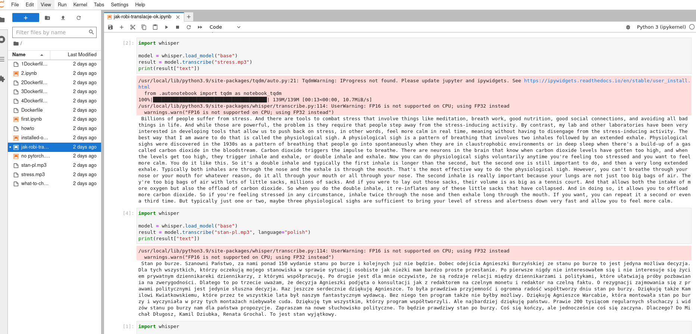
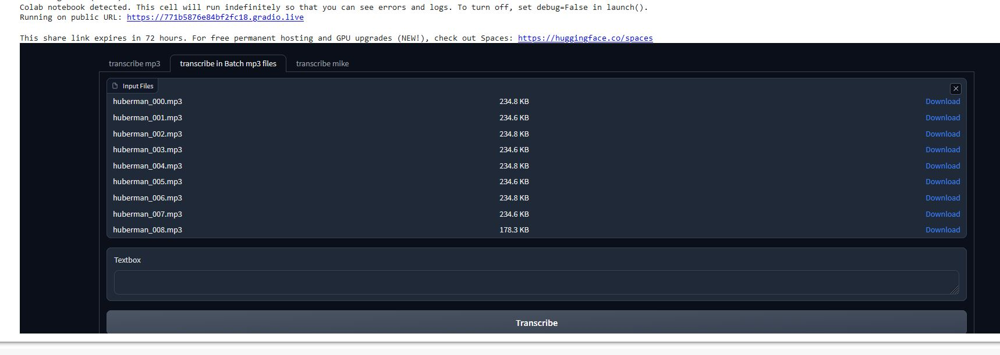
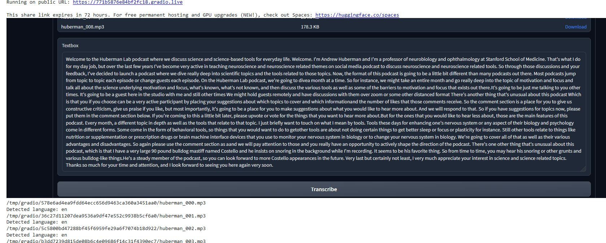

## FFmpeg and docker plus Whisper power of transcripting


"Whisper is an open-source Python package developed by OpenAI that provides speech recognition capabilities. More information about Whisper can be found on their GitHub page (https://github.com/openai/whisper). I was interested in using Whisper to transcribe my own MP3 files in a private environment.

To avoid polluting my own OS, I decided to build a Docker image and perform all my trials within the container. I shared a directory with the Docker container and prepared Python or Bash scripts locally to execute on specific directories or files.

Summary of potential for most common lanugaes are  impressive based on the picture from  their github 

To create the Docker image, I started with a lightweight Python 3.9 slim-buster image with FFMPEG content and JupyterLab, which was around 800MB in size. I then followed the instructions for installing Whisper on a standard Linux environment and translated them into the content for my Dockerfile.

While creating the Docker image, I encountered some issues, such as missing libraries that required updates one by one. Initially, I did not address security issues, such as allowing root in the Docker container, which could  threaten the host OS.

The final Dockerfile is provided below, and the size is about 8GB, mostly due to the PyTorch framework."

```
FROM python:3.9-slim-buster

# Install dependencies git was required
RUN apt-get update && \
    apt-get install -y ffmpeg git

# Install JupyterLab, FFMPEG-Python, and PyTorch
RUN pip install --upgrade  jupyterlab ffmpeg-python torch==1.10.1 torchvision torchaudio -f https://download.pytorch.org/whl/cu111/torch_stable.html tqdm tiktoken numba
 
# https://github.com/openai/whisper
# Install whisper
RUN pip install --upgrade --no-deps --force-reinstall git+https://github.com/openai/whisper.git

# Set the working directory
WORKDIR /app
ENV JUPYTER_PORT 8888


# Launch JupyterLab
CMD ["jupyter", "lab", "--ip=0.0.0.0", "--allow-root"]

```
### Build the Docker image:
Once you have created the Dockerfile, you can build the Docker image using the following command:

```
docker build -t my_image_name .
```
and running 
```
docker run --rm  -p 8888:8888 -v $(pwd):$(pwd) -w $(pwd) --cpus 2 --name whispi my_image_name
```

whispi is temporary name for container 

I limited usage to 2 CPU to avoid crashes of host system

It was tested on base model and  english 2min stress.mp3 from Hubermanlab   polish stan-pl.mp3 from onet.pl
to check other lenguage performance.
Result as expected are stunning.



Things to improve removing security issues from image root etc  in Dockerfie 
optimising RUN to avoid creating extra layers 

##   Auxilary tools and solution for pre/post
processing of audio and video based on ffmpeg and other open source tools

### Processing mp4 files using Colab
all the processing should be able to do in Colab environment with all its advantages and constrains
* Function for downloading and saving m3u8 stream to mp4 file with given length per a piece in Colab
* snippet for cuuting/triming video with recompilation to avoid problems with broken frames
* snippets to slow down speed up audion 

you could alse use extra gradio interface  to have simple and elegant GIU solution for front end for all kinds of application:
including processing mp3 files in batch 
mp3 file was chopped to 30s pieces with ffmpeg so the 
audio.shape os equal  (480000,)


---
example is included [whisper-in-colab-batch-microphe-mp3-conversion-with-gradio.ipynb](whisper-in-colab-batch-microphe-mp3-conversion-with-gradio.ipynb)




---
### [Colab](https://github.com/len-sla/ffmpeg/blob/main/Using_ffmpeg_pre_post_process.ipynb)
Colab is conviniet when you dont care about privacy though for some operations with private file like 
changing converting your private videos I recomend using ffmpeg on local machine.
Someone could say that installing whole environment could take  a while and will not be so simple.
Then what for once you have docker some ready to use image and then temporary container could be utilised.

---
### processing mp4 files using bash script and ffmpeg installed in Docker environment to avoid polluting OS
I need to mention here excellent work of  the  Julien Rottenberg's team  
https://github.com/jrottenberg/ffmpeg


You can install the latest build of this image by running:
```
docker pull jrottenberg/ffmpeg:${VERSION}-${VARIANT} or docker pull ghcr.io/jrottenberg/ffmpeg:${VERSION}-${VARIANT}.
```
Example which is converting high resolution video to from handy to some  rescaled  mp4 640x ... is below( working like charm)

```
docker run --rm -d -v $(pwd):$(pwd) -w $(pwd) --name mp4-converter jrottenberg/ffmpeg:4.4-ubuntu -i /mnt/c/docker_out/ffmpeg/dzia/po3.mp4 -vf scale=640:-1 /mnt/c/docker_out/ffmpeg/dzia/_po3.mp4
```
excellent guides are there but giving short info 
about my example after -i( interactive)  flag is path with input file _/mnt/c/docker_out/ffmpeg/dzia/po3.mp4_ and otput file 
_/mnt/c/docker_out/ffmpeg/dzia/_po3.mp4_

If there is need to convert whole directory this time (to change a bit subject convertig mp3 to wav format) then preparing some bash script where  docker converter is inside do the job.
Content of the script could be as follows:


```
for i in *.mp4;

	do	docker run --rm -d -v $(pwd):$(pwd) -w $(pwd) --cpus 3 --name "$i" jrottenberg/ffmpeg:4.4-ubuntu -i "$i" -b:v 1M  "$(basename "$i" .mp4)"_re.mp4  ;
	name=`echo "$i" | cut -d'.' -f1`;
	echo "$name"	;

	sleep 1
done
```


You need to be careful with allocating resources in this case CPU( _--cpus 3_) I limited that to 3  ( it is not particularly memory intensive process convertig 200MB file to 1Mb rate uses ~300MB memory.
Once you allocate resources batch will take care about whole process utilising machine resources withing given limit.


---

### Technologies
* Python, 
* ffmpeg, 
* docker,
* bash,

### Setup
easiest is to install/update libraries accordnig to install secion in notebook


### Status
Project is: _in progress_ 


### Other information
Notebook is divided on universal fuctions whicht  could be easlily used elsewhere.


### Contact
Created by: _lencz.sla@gmail.com_

