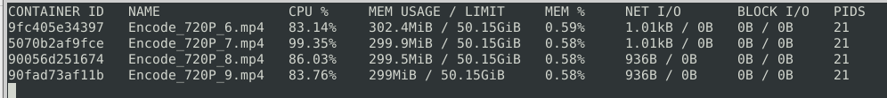

## Project Name
> Auxilary tools and solution for pre/post
processing of audio and video based on ffmpeg

### General info
all the processing should be able to do in Colab environment with all its advantages and constrains
* Function for downloading and saving m3u8 stream to mp4 file with given length per a piece in Colab
* snippet for cuuting/triming video with recompilation to avoid problems with broken frames
* snippets to slow down speed up audion 


---
### [Colab](https://github.com/len-sla/ffmpeg/blob/main/Using_ffmpeg_pre_post_process.ipynb)
Colab is conviniet when you dont care about privacy though for some operations with private file like 
changing converting your private videos I recomend using ffmpeg on local machine.
Someone could say that installing whole environment could take  a while and will not be so simple.
Then what for once you have docker some ready to use image and then temporary container could be utilised.

---
### Local with docker
I need to mention here excellent work of  the  Julien Rottenberg's team  
https://github.com/jrottenberg/ffmpeg


You can install the latest build of this image by running:
```
docker pull jrottenberg/ffmpeg:${VERSION}-${VARIANT} or docker pull ghcr.io/jrottenberg/ffmpeg:${VERSION}-${VARIANT}.
```
Example which is converting high resolution video to from handy to some  rescaled  mp4 640x ... is below( working like charm)

```
docker run --rm -d -v $(pwd):$(pwd) -w $(pwd) --name mp4-converter jrottenberg/ffmpeg:4.4-ubuntu -i /mnt/c/docker_out/ffmpeg/dzia/po3.mp4 -vf scale=640:-1 /mnt/c/docker_out/ffmpeg/dzia/_po3.mp4
```
excellent guides are there but giving short info 
about my example after -i( interactive)  flag is path with input file _/mnt/c/docker_out/ffmpeg/dzia/po3.mp4_ and otput file 
_/mnt/c/docker_out/ffmpeg/dzia/_po3.mp4_

If there is need to convert whole directory this time (to change a bit subject convertig mp3 to wav format) then preparing some bash script where  docker converter is inside do the job.
Content of the script could be as follows:


```
for i in *.mp4;

	do	docker run --rm -d -v $(pwd):$(pwd) -w $(pwd) --cpus 3 --name "$i" jrottenberg/ffmpeg:4.4-ubuntu -i "$i" -b:v 1M  "$(basename "$i" .mp4)"_re.mp4  ;
	name=`echo "$i" | cut -d'.' -f1`;
	echo "$name"	;

	sleep 1
done
```


You need to be careful with allocating resources in this case CPU( _--cpus 3_) I limited that to 3  ( it is not particularly memory intensive process convertig 200MB file to 1Mb rate uses ~300MB memory.
Once you allocate resources batch will take care about whole process utilising machine resources withing given limit.



---

### Technologies
* Python, 
* ffmpeg, 
* docker,
* bash,

### Setup
easiest is to install/update libraries accordnig to install secion in notebook


### Status
Project is: _in progress_ 


### Other information
Notebook is divided on universal fuctions whicht  could be easlily used elsewhere.


### Contact
Created by: _lencz.sla@gmail.com_

